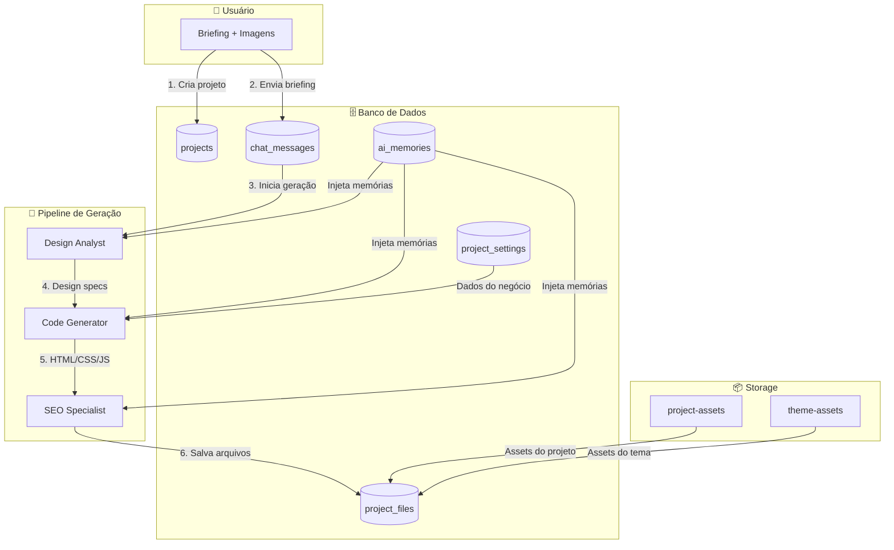
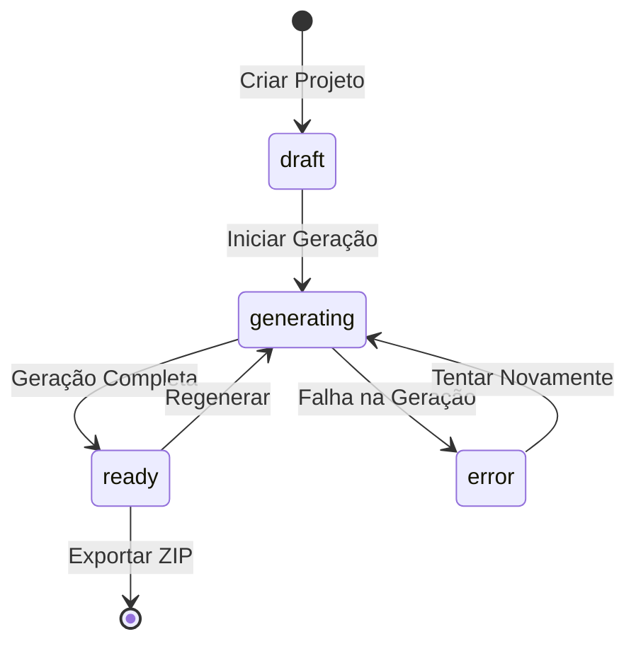

# PHPVibe 4.0 - Documentação do Banco de Dados

## Índice

1. [Visão Geral](#visão-geral)
2. [Diagrama ER](#diagrama-er)
3. [Tabelas](#tabelas)
4. [Funções do Banco](#funções-do-banco)
5. [Triggers](#triggers)
6. [Políticas RLS](#políticas-rls)
7. [Storage Buckets](#storage-buckets)
8. [Índices](#índices)
9. [Secrets (Variáveis de Ambiente)](#secrets)

---

## Visão Geral

O PHPVibe 4.0 utiliza **PostgreSQL** através do **Supabase (Lovable Cloud)** como banco de dados principal. O modelo de dados foi projetado para suportar:

- Gestão de projetos de websites
- Armazenamento de arquivos gerados (HTML/CSS/JS)
- Histórico de conversas com IA
- Base de conhecimento para treinamento dos agentes
- Sistema de versionamento de layouts
- Biblioteca de temas/templates
- Configurações personalizadas por projeto

### Convenções

- **IDs**: Todos os identificadores primários são `UUID` com `gen_random_uuid()`
- **Timestamps**: Colunas `created_at` e `updated_at` em formato `TIMESTAMPTZ`
- **RLS**: Row Level Security habilitado com políticas públicas (MVP sem autenticação)
- **Cascade**: Relacionamentos com `ON DELETE CASCADE` para integridade referencial

---

## Diagrama ER

### Diagrama Mermaid - Entidade Relacionamento

```mermaid
erDiagram
    %% ==========================================
    %% CORE: Projects & Related Tables
    %% ==========================================
    
    projects {
        uuid id PK "gen_random_uuid()"
        text name "NOT NULL"
        text description
        text status "DEFAULT 'draft'"
        jsonb layout_tree
        text thumbnail_url
        timestamptz created_at "DEFAULT now()"
        timestamptz updated_at "DEFAULT now()"
    }
    
    project_files {
        uuid id PK "gen_random_uuid()"
        uuid project_id FK "NOT NULL"
        text file_path "NOT NULL"
        text file_name "NOT NULL"
        text file_type "NOT NULL"
        text content "NOT NULL"
        timestamptz created_at "DEFAULT now()"
        timestamptz updated_at "DEFAULT now()"
    }
    
    project_settings {
        uuid id PK "gen_random_uuid()"
        uuid project_id FK "UNIQUE NOT NULL"
        text company_name
        text slogan
        text logo_url
        text favicon_url
        text_array gallery_images "DEFAULT '{}'"
        text address
        text city
        text state
        text zip_code
        text phone
        text whatsapp
        text email
        jsonb social_links "DEFAULT '{}'"
        jsonb business_hours "DEFAULT '{}'"
        jsonb custom_fields "DEFAULT '{}'"
        timestamptz created_at "DEFAULT now()"
        timestamptz updated_at "DEFAULT now()"
    }
    
    chat_messages {
        uuid id PK "gen_random_uuid()"
        uuid project_id FK "NOT NULL"
        text role "NOT NULL"
        text content "NOT NULL"
        jsonb metadata "DEFAULT '{}'"
        timestamptz created_at "DEFAULT now()"
    }
    
    layout_versions {
        uuid id PK "gen_random_uuid()"
        uuid project_id FK "NOT NULL"
        jsonb layout_tree "NOT NULL"
        integer version_number "AUTO-INCREMENT"
        text commit_message
        boolean is_current "DEFAULT true"
        text created_by
        timestamptz created_at "DEFAULT now()"
    }
    
    page_templates {
        uuid id PK "gen_random_uuid()"
        uuid project_id FK "NOT NULL"
        text name "NOT NULL"
        text source_file_path "NOT NULL"
        text_array tags "DEFAULT '{}'"
        text output_pattern "DEFAULT '{slug}.html'"
        text output_folder "DEFAULT 'pages'"
        jsonb variations "DEFAULT '[]'"
        timestamptz created_at "DEFAULT now()"
        timestamptz updated_at "DEFAULT now()"
    }
    
    %% ==========================================
    %% THEMES: Template Library
    %% ==========================================
    
    themes {
        uuid id PK "gen_random_uuid()"
        text name "NOT NULL"
        text description
        text category "DEFAULT 'general'"
        text preview_image_url
        integer file_count "DEFAULT 0"
        bigint total_size_bytes "DEFAULT 0"
        boolean is_active "DEFAULT true"
        text_array tags "DEFAULT '{}'"
        timestamptz created_at "DEFAULT now()"
        timestamptz updated_at "DEFAULT now()"
    }
    
    theme_files {
        uuid id PK "gen_random_uuid()"
        uuid theme_id FK "NOT NULL CASCADE"
        text file_path "NOT NULL"
        text file_name "NOT NULL"
        text file_type "NOT NULL"
        text content
        text storage_url
        integer size_bytes "DEFAULT 0"
        timestamptz created_at "DEFAULT now()"
    }
    
    %% ==========================================
    %% AI: Agents & Knowledge Base
    %% ==========================================
    
    ai_agents {
        uuid id PK "gen_random_uuid()"
        text name "NOT NULL"
        text slug "UNIQUE NOT NULL"
        text description
        text system_prompt
        text color "DEFAULT 'blue'"
        text icon "DEFAULT 'bot'"
        boolean is_active "DEFAULT true"
        boolean is_system "DEFAULT false"
        timestamptz created_at "DEFAULT now()"
        timestamptz updated_at "DEFAULT now()"
    }
    
    ai_memories {
        uuid id PK "gen_random_uuid()"
        text title "NOT NULL"
        text content "NOT NULL"
        text type "DEFAULT 'instruction'"
        text category "DEFAULT 'general'"
        text agent "DEFAULT 'all'"
        integer priority "DEFAULT 0"
        boolean is_active "DEFAULT true"
        boolean is_system "DEFAULT false"
        timestamptz created_at "DEFAULT now()"
        timestamptz updated_at "DEFAULT now()"
    }
    
    %% ==========================================
    %% RELATIONSHIPS
    %% ==========================================
    
    projects ||--o{ project_files : "has many"
    projects ||--o| project_settings : "has one"
    projects ||--o{ chat_messages : "has many"
    projects ||--o{ layout_versions : "has many"
    projects ||--o{ page_templates : "has many"
    
    themes ||--o{ theme_files : "has many (CASCADE)"
```



### Diagrama de Fluxo de Dados



### Diagrama de Estados do Projeto



---

## Tabelas

### 1. `projects`

Armazena os projetos de websites criados pelos usuários.

| Coluna | Tipo | Nullable | Default | Descrição |
|--------|------|----------|---------|-----------|
| `id` | UUID | NOT NULL | `gen_random_uuid()` | Identificador único |
| `name` | TEXT | NOT NULL | - | Nome do projeto |
| `description` | TEXT | NULL | - | Descrição/briefing do projeto |
| `status` | TEXT | NOT NULL | `'draft'` | Estado: draft, generating, ready, error |
| `layout_tree` | JSONB | NULL | - | Estrutura de layout (legado) |
| `thumbnail_url` | TEXT | NULL | - | URL da thumbnail |
| `created_at` | TIMESTAMPTZ | NOT NULL | `now()` | Data de criação |
| `updated_at` | TIMESTAMPTZ | NOT NULL | `now()` | Última atualização |

**Constraints:**
- PRIMARY KEY: `id`

**Triggers:**
- `update_projects_updated_at` - Atualiza `updated_at` automaticamente

---

### 2. `project_files`

Armazena os arquivos gerados para cada projeto.

| Coluna | Tipo | Nullable | Default | Descrição |
|--------|------|----------|---------|-----------|
| `id` | UUID | NOT NULL | `gen_random_uuid()` | Identificador único |
| `project_id` | UUID | NOT NULL | - | FK para projects |
| `file_path` | TEXT | NOT NULL | - | Caminho completo (ex: "css/styles.css") |
| `file_name` | TEXT | NOT NULL | - | Nome do arquivo |
| `file_type` | TEXT | NOT NULL | - | Tipo: html, css, js, json, text, xml |
| `content` | TEXT | NOT NULL | - | Conteúdo do arquivo |
| `created_at` | TIMESTAMPTZ | NOT NULL | `now()` | Data de criação |
| `updated_at` | TIMESTAMPTZ | NOT NULL | `now()` | Última atualização |

**Constraints:**
- PRIMARY KEY: `id`
- UNIQUE: `(project_id, file_path)`

**Triggers:**
- `update_project_files_updated_at` - Atualiza `updated_at` automaticamente

---

### 3. `project_settings`

Configurações personalizadas de cada projeto (dados do negócio).

| Coluna | Tipo | Nullable | Default | Descrição |
|--------|------|----------|---------|-----------|
| `id` | UUID | NOT NULL | `gen_random_uuid()` | Identificador único |
| `project_id` | UUID | NOT NULL | - | FK para projects |
| `company_name` | TEXT | NULL | - | Nome da empresa |
| `slogan` | TEXT | NULL | - | Slogan da empresa |
| `logo_url` | TEXT | NULL | - | URL do logotipo |
| `favicon_url` | TEXT | NULL | - | URL do favicon |
| `gallery_images` | TEXT[] | NULL | `'{}'` | URLs das imagens da galeria |
| `address` | TEXT | NULL | - | Endereço |
| `city` | TEXT | NULL | - | Cidade |
| `state` | TEXT | NULL | - | Estado |
| `zip_code` | TEXT | NULL | - | CEP |
| `phone` | TEXT | NULL | - | Telefone |
| `whatsapp` | TEXT | NULL | - | WhatsApp |
| `email` | TEXT | NULL | - | E-mail |
| `social_links` | JSONB | NULL | `'{}'` | Links de redes sociais |
| `business_hours` | JSONB | NULL | `'{}'` | Horários de funcionamento |
| `custom_fields` | JSONB | NULL | `'{}'` | Campos personalizados |
| `created_at` | TIMESTAMPTZ | NOT NULL | `now()` | Data de criação |
| `updated_at` | TIMESTAMPTZ | NOT NULL | `now()` | Última atualização |

**Constraints:**
- PRIMARY KEY: `id`
- UNIQUE: `project_id`

**Estrutura `social_links` (JSONB):**
```json
{
  "facebook": "https://facebook.com/empresa",
  "instagram": "https://instagram.com/empresa",
  "linkedin": "https://linkedin.com/company/empresa",
  "twitter": "https://twitter.com/empresa",
  "youtube": "https://youtube.com/empresa",
  "tiktok": "https://tiktok.com/@empresa"
}
```

**Estrutura `business_hours` (JSONB):**
```json
{
  "monday": { "open": "08:00", "close": "18:00", "closed": false },
  "tuesday": { "open": "08:00", "close": "18:00", "closed": false },
  "wednesday": { "open": "08:00", "close": "18:00", "closed": false },
  "thursday": { "open": "08:00", "close": "18:00", "closed": false },
  "friday": { "open": "08:00", "close": "18:00", "closed": false },
  "saturday": { "open": "08:00", "close": "12:00", "closed": false },
  "sunday": { "open": "", "close": "", "closed": true }
}
```

**Triggers:**
- `update_project_settings_updated_at` - Atualiza `updated_at` automaticamente

---

### 4. `chat_messages`

Histórico de mensagens do chat de cada projeto.

| Coluna | Tipo | Nullable | Default | Descrição |
|--------|------|----------|---------|-----------|
| `id` | UUID | NOT NULL | `gen_random_uuid()` | Identificador único |
| `project_id` | UUID | NOT NULL | - | FK para projects |
| `role` | TEXT | NOT NULL | - | user, assistant, system |
| `content` | TEXT | NOT NULL | - | Conteúdo da mensagem |
| `metadata` | JSONB | NULL | `'{}'` | Metadados adicionais |
| `created_at` | TIMESTAMPTZ | NOT NULL | `now()` | Data de criação |

**Constraints:**
- PRIMARY KEY: `id`

**Índices:**
- `idx_chat_messages_project_created` ON `(project_id, created_at)`

---

### 5. `layout_versions`

Histórico de versões dos layouts gerados.

| Coluna | Tipo | Nullable | Default | Descrição |
|--------|------|----------|---------|-----------|
| `id` | UUID | NOT NULL | `gen_random_uuid()` | Identificador único |
| `project_id` | UUID | NOT NULL | - | FK para projects |
| `layout_tree` | JSONB | NOT NULL | - | Snapshot do layout |
| `version_number` | INTEGER | NOT NULL | `1` | Número da versão (auto-incremento) |
| `commit_message` | TEXT | NULL | - | Descrição da versão |
| `is_current` | BOOLEAN | NOT NULL | `true` | Se é a versão atual |
| `created_by` | TEXT | NULL | - | Criador da versão |
| `created_at` | TIMESTAMPTZ | NOT NULL | `now()` | Data de criação |

**Constraints:**
- PRIMARY KEY: `id`

**Triggers:**
- `increment_version_number` - Auto-incrementa `version_number` por projeto
- `set_previous_versions_not_current` - Define `is_current = false` nas versões anteriores

---

### 6. `page_templates`

Templates para geração em massa de páginas.

| Coluna | Tipo | Nullable | Default | Descrição |
|--------|------|----------|---------|-----------|
| `id` | UUID | NOT NULL | `gen_random_uuid()` | Identificador único |
| `project_id` | UUID | NOT NULL | - | FK para projects |
| `name` | TEXT | NOT NULL | - | Nome do template |
| `source_file_path` | TEXT | NOT NULL | - | Arquivo base |
| `tags` | TEXT[] | NOT NULL | `'{}'` | Tags detectadas ({bairro}, {cidade}, etc.) |
| `output_pattern` | TEXT | NOT NULL | `'{slug}.html'` | Padrão de nome de saída |
| `output_folder` | TEXT | NULL | `'pages'` | Pasta de destino |
| `variations` | JSONB | NOT NULL | `'[]'` | Array de variações |
| `created_at` | TIMESTAMPTZ | NULL | `now()` | Data de criação |
| `updated_at` | TIMESTAMPTZ | NULL | `now()` | Última atualização |

**Constraints:**
- PRIMARY KEY: `id`

**Estrutura `variations` (JSONB):**
```json
[
  { "bairro": "Centro", "cidade": "São Paulo", "slug": "centro-sp" },
  { "bairro": "Moema", "cidade": "São Paulo", "slug": "moema-sp" },
  { "bairro": "Pinheiros", "cidade": "São Paulo", "slug": "pinheiros-sp" }
]
```

---

### 7. `themes`

Biblioteca de temas/templates HTML para uso como base em novos projetos.

| Coluna | Tipo | Nullable | Default | Descrição |
|--------|------|----------|---------|-----------|
| `id` | UUID | NOT NULL | `gen_random_uuid()` | Identificador único |
| `name` | TEXT | NOT NULL | - | Nome do tema |
| `description` | TEXT | NULL | - | Descrição do tema |
| `category` | TEXT | NULL | `'general'` | Categoria do tema |
| `preview_image_url` | TEXT | NULL | - | URL da imagem de preview |
| `file_count` | INTEGER | NULL | `0` | Quantidade de arquivos |
| `total_size_bytes` | BIGINT | NULL | `0` | Tamanho total em bytes |
| `is_active` | BOOLEAN | NULL | `true` | Se está ativo |
| `tags` | TEXT[] | NULL | `'{}'` | Tags do tema |
| `created_at` | TIMESTAMPTZ | NULL | `now()` | Data de criação |
| `updated_at` | TIMESTAMPTZ | NULL | `now()` | Última atualização |

**Constraints:**
- PRIMARY KEY: `id`

**Categorias válidas:**
- `general` - Templates genéricos
- `clinic` - Clínicas e consultórios
- `restaurant` - Restaurantes e pizzarias
- `service` - Empresas de serviços
- `ecommerce` - Lojas virtuais
- `portfolio` - Portfólios pessoais
- `landing` - Landing pages

**Triggers:**
- `update_themes_updated_at` - Atualiza `updated_at` automaticamente

---

### 8. `theme_files`

Arquivos extraídos dos temas (após upload do ZIP).

| Coluna | Tipo | Nullable | Default | Descrição |
|--------|------|----------|---------|-----------|
| `id` | UUID | NOT NULL | `gen_random_uuid()` | Identificador único |
| `theme_id` | UUID | NOT NULL | - | FK para themes (CASCADE DELETE) |
| `file_path` | TEXT | NOT NULL | - | Caminho do arquivo |
| `file_name` | TEXT | NOT NULL | - | Nome do arquivo |
| `file_type` | TEXT | NOT NULL | - | Tipo do arquivo |
| `content` | TEXT | NULL | - | Conteúdo (para arquivos de texto) |
| `storage_url` | TEXT | NULL | - | URL no storage (para arquivos binários) |
| `size_bytes` | INTEGER | NULL | `0` | Tamanho em bytes |
| `created_at` | TIMESTAMPTZ | NULL | `now()` | Data de criação |

**Constraints:**
- PRIMARY KEY: `id`
- UNIQUE: `(theme_id, file_path)`
- FOREIGN KEY: `theme_id` REFERENCES `themes(id)` ON DELETE CASCADE

**Índices:**
- `idx_theme_files_theme_id` ON `(theme_id)`

**Tipos de arquivo:**
- Texto (armazenados em `content`): html, htm, php, css, scss, sass, less, js, ts, jsx, tsx, json, xml, svg, txt, md
- Binários (armazenados no storage): jpg, jpeg, png, gif, webp, ico, bmp, woff, woff2, ttf, eot, otf, pdf

---

### 9. `ai_agents`

Configuração dos agentes de IA do pipeline.

| Coluna | Tipo | Nullable | Default | Descrição |
|--------|------|----------|---------|-----------|
| `id` | UUID | NOT NULL | `gen_random_uuid()` | Identificador único |
| `name` | TEXT | NOT NULL | - | Nome do agente |
| `slug` | TEXT | NOT NULL | - | Identificador único |
| `description` | TEXT | NULL | - | Descrição do papel do agente |
| `system_prompt` | TEXT | NULL | - | Prompt customizado (opcional) |
| `color` | TEXT | NOT NULL | `'blue'` | Cor do agente na UI |
| `icon` | TEXT | NULL | `'bot'` | Ícone Lucide |
| `is_active` | BOOLEAN | NULL | `true` | Se está ativo |
| `is_system` | BOOLEAN | NULL | `false` | Se é agente do sistema |
| `created_at` | TIMESTAMPTZ | NOT NULL | `now()` | Data de criação |
| `updated_at` | TIMESTAMPTZ | NOT NULL | `now()` | Última atualização |

**Constraints:**
- PRIMARY KEY: `id`
- UNIQUE: `slug`

**Agentes do sistema:**
- `design_analyst` - Analisa imagens e define cores, fontes, layout
- `code_generator` - Gera HTML, CSS e JavaScript
- `seo_specialist` - Otimiza meta tags, Schema.org, breadcrumbs

---

### 10. `ai_memories`

Base de conhecimento que influencia a geração de sites.

| Coluna | Tipo | Nullable | Default | Descrição |
|--------|------|----------|---------|-----------|
| `id` | UUID | NOT NULL | `gen_random_uuid()` | Identificador único |
| `title` | TEXT | NOT NULL | - | Título da memória |
| `content` | TEXT | NOT NULL | - | Conteúdo/instruções |
| `type` | TEXT | NOT NULL | `'instruction'` | instruction, document, template |
| `category` | TEXT | NULL | `'general'` | Categoria da memória |
| `agent` | TEXT | NULL | `'all'` | Agente alvo |
| `priority` | INTEGER | NULL | `0` | Prioridade (maior = mais influente) |
| `is_active` | BOOLEAN | NULL | `true` | Se está ativa |
| `is_system` | BOOLEAN | NULL | `false` | Se é memória do sistema |
| `created_at` | TIMESTAMPTZ | NOT NULL | `now()` | Data de criação |
| `updated_at` | TIMESTAMPTZ | NOT NULL | `now()` | Última atualização |

**Constraints:**
- PRIMARY KEY: `id`

**Categorias:**
- `general` - Geral
- `branding` - Branding
- `content` - Conteúdo
- `estrutura` - Estrutura
- `estilo` - Estilo
- `business` - Negócio

**Agentes:**
- `all` - Compartilhadas (usadas por todos)
- `design_analyst` - Design Analyst
- `code_generator` - Code Generator
- `seo_specialist` - SEO Specialist

---

## Funções do Banco

### `update_updated_at_column()`

Atualiza automaticamente a coluna `updated_at` para o timestamp atual.

```sql
CREATE OR REPLACE FUNCTION public.update_updated_at_column()
RETURNS TRIGGER AS $$
BEGIN
  NEW.updated_at = now();
  RETURN NEW;
END;
$$ LANGUAGE plpgsql SECURITY DEFINER SET search_path = public;
```

### `increment_version_number()`

Auto-incrementa o `version_number` para cada projeto em `layout_versions`.

```sql
CREATE OR REPLACE FUNCTION public.increment_version_number()
RETURNS TRIGGER AS $$
BEGIN
  SELECT COALESCE(MAX(version_number), 0) + 1 INTO NEW.version_number
  FROM public.layout_versions
  WHERE project_id = NEW.project_id;
  RETURN NEW;
END;
$$ LANGUAGE plpgsql SECURITY DEFINER SET search_path = public;
```

### `set_previous_versions_not_current()`

Define `is_current = false` em todas as versões anteriores quando uma nova é criada.

```sql
CREATE OR REPLACE FUNCTION public.set_previous_versions_not_current()
RETURNS TRIGGER AS $$
BEGIN
  UPDATE public.layout_versions
  SET is_current = false
  WHERE project_id = NEW.project_id AND id != NEW.id;
  RETURN NEW;
END;
$$ LANGUAGE plpgsql SECURITY DEFINER SET search_path = public;
```

---

## Triggers

| Tabela | Trigger | Função | Evento |
|--------|---------|--------|--------|
| `projects` | `update_projects_updated_at` | `update_updated_at_column()` | BEFORE UPDATE |
| `project_files` | `update_project_files_updated_at` | `update_updated_at_column()` | BEFORE UPDATE |
| `project_settings` | `update_project_settings_updated_at` | `update_updated_at_column()` | BEFORE UPDATE |
| `themes` | `update_themes_updated_at` | `update_updated_at_column()` | BEFORE UPDATE |
| `ai_agents` | `update_ai_agents_updated_at` | `update_updated_at_column()` | BEFORE UPDATE |
| `ai_memories` | `update_ai_memories_updated_at` | `update_updated_at_column()` | BEFORE UPDATE |
| `layout_versions` | `increment_version_number` | `increment_version_number()` | BEFORE INSERT |
| `layout_versions` | `set_previous_versions_not_current` | `set_previous_versions_not_current()` | AFTER INSERT |

---

## Políticas RLS

> ⚠️ **Nota**: Para o MVP, todas as tabelas usam políticas públicas (sem autenticação). Em produção, estas devem ser substituídas por políticas baseadas em `auth.uid()`.

### Padrão atual (MVP público)

Todas as tabelas com RLS habilitado utilizam o mesmo padrão de políticas:

```sql
-- Habilitar RLS
ALTER TABLE public.<tabela> ENABLE ROW LEVEL SECURITY;

-- Políticas públicas (MVP)
CREATE POLICY "Public read <tabela>" ON public.<tabela> FOR SELECT USING (true);
CREATE POLICY "Public insert <tabela>" ON public.<tabela> FOR INSERT WITH CHECK (true);
CREATE POLICY "Public update <tabela>" ON public.<tabela> FOR UPDATE USING (true);
CREATE POLICY "Public delete <tabela>" ON public.<tabela> FOR DELETE USING (true);
```

### Tabelas com RLS

| Tabela | RLS Habilitado | Políticas |
|--------|----------------|-----------|
| `projects` | ✅ | Public CRUD |
| `project_files` | ✅ | Public CRUD |
| `project_settings` | ✅ | Public CRUD |
| `chat_messages` | ❌ | - |
| `layout_versions` | ✅ | Public CRUD |
| `page_templates` | ✅ | Public CRUD |
| `themes` | ✅ | Public CRUD |
| `theme_files` | ✅ | Public CRUD |
| `ai_agents` | ❌ | - |
| `ai_memories` | ❌ | - |

---

## Storage Buckets

### `project-assets`

Armazena assets dos projetos (imagens de referência, logos, documentos).

| Propriedade | Valor |
|-------------|-------|
| **ID** | `project-assets` |
| **Público** | Sim |
| **Tamanho máximo** | 50MB |

**Políticas:**
- SELECT: Público
- INSERT: Público
- UPDATE: Público
- DELETE: Público

### `theme-assets`

Armazena arquivos binários dos temas (imagens, fontes).

| Propriedade | Valor |
|-------------|-------|
| **ID** | `theme-assets` |
| **Público** | Sim |
| **Tamanho máximo** | 50MB |

**Políticas:**
- SELECT: Público (`bucket_id = 'theme-assets'`)
- INSERT: Público (`bucket_id = 'theme-assets'`)
- DELETE: Público (`bucket_id = 'theme-assets'`)

**Estrutura de pastas:**
```
theme-assets/
└── {theme_id}/
    ├── images/
    │   ├── logo.png
    │   └── hero.jpg
    └── fonts/
        └── custom.woff2
```

---

## Índices

| Tabela | Índice | Colunas | Tipo |
|--------|--------|---------|------|
| `chat_messages` | `idx_chat_messages_project_created` | `(project_id, created_at)` | B-tree |
| `theme_files` | `idx_theme_files_theme_id` | `(theme_id)` | B-tree |

---

## Secrets

Variáveis de ambiente configuradas no Supabase:

| Secret | Descrição |
|--------|-----------|
| `SUPABASE_URL` | URL do projeto Supabase |
| `SUPABASE_ANON_KEY` | Chave anônima (cliente) |
| `SUPABASE_SERVICE_ROLE_KEY` | Chave de serviço (admin) |
| `SUPABASE_DB_URL` | URL de conexão PostgreSQL |
| `SUPABASE_PUBLISHABLE_KEY` | Chave publicável |
| `LOVABLE_API_KEY` | Chave API Lovable AI |
| `OPENAI_API_KEY` | Chave API OpenAI |

---

## Queries Úteis

### Listar projetos com contagem de arquivos

```sql
SELECT 
  p.id,
  p.name,
  p.status,
  COUNT(pf.id) as file_count,
  p.created_at
FROM projects p
LEFT JOIN project_files pf ON p.id = pf.project_id
GROUP BY p.id
ORDER BY p.created_at DESC;
```

### Buscar memórias ativas por agente

```sql
SELECT * FROM ai_memories
WHERE is_active = true
  AND (agent = 'code_generator' OR agent = 'all')
ORDER BY priority DESC, created_at DESC;
```

### Listar temas com arquivos

```sql
SELECT 
  t.id,
  t.name,
  t.category,
  t.file_count,
  t.total_size_bytes,
  COUNT(tf.id) as actual_files
FROM themes t
LEFT JOIN theme_files tf ON t.id = tf.theme_id
WHERE t.is_active = true
GROUP BY t.id
ORDER BY t.created_at DESC;
```

### Histórico de versões de um projeto

```sql
SELECT 
  version_number,
  commit_message,
  is_current,
  created_at
FROM layout_versions
WHERE project_id = 'uuid-do-projeto'
ORDER BY version_number DESC;
```

---

*Documentação do banco de dados - PHPVibe 4.0*
*Versão: 4.1.0*
*Atualizada em: Dezembro 2025*
